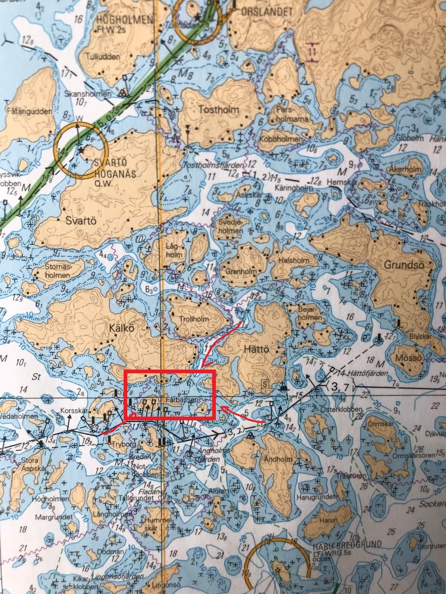
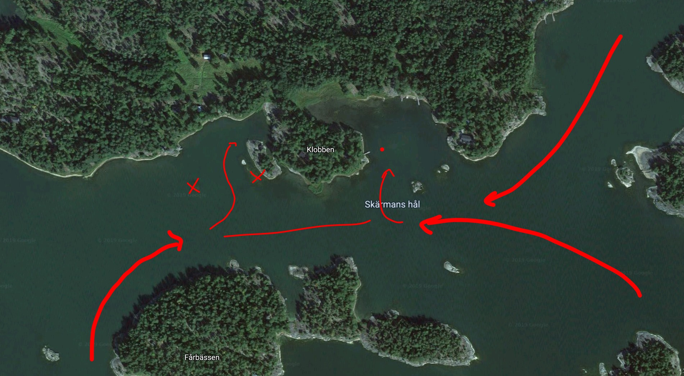

# Södernäs, Kälkö (Klobben)

*59°55'06.2"N 23°50'01.3"E - Sjökort B632*

Ankomst från "postfaret" både väster- och österifrån ganska lätt och problemfri. Norrifrån mellan Hättö och Kälkö även lätt och problemfri. Bryggor finns både på västra och östra sidan.

På västra sidan finns stenar och grunt vatten som man måste akta, ungefär upp till ca 20m från stranden. Ett grund finns också 50m rakt ut från västra grannens brygga. Annars inga problem. Man kan bra lägga till på insidan av bryggan.

På östra sidan finns inget farligt, dock lite grundare vatten än på västra sidan. Där finns en boj som kan utnyttjas.
